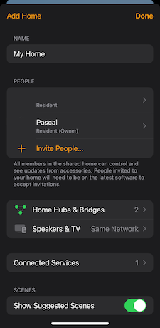
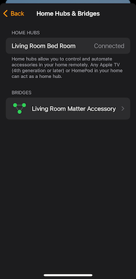
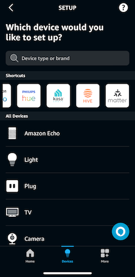
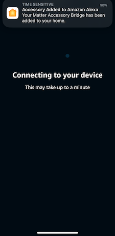

# Connect multiple assistants to one bridge

It is possible to connect a single bridge with multiple fabrics, but note that the same QR code cannot be
used twice. The process involves commissioning the bridge with the first controller using the provided QR code.
Subsequently, you can use the first controller to link the bridge to additional controllers.

After successfully connecting the first controller (e.g., Apple Home), locate the hub device in the app. For Alexa, it
appears as a standalone device, while in Apple Home, it is nested within the Home settings. In the device settings,
enable pairing mode to generate a manual pairing code. This code can then be used to connect the bridge to subsequent
controllers.

---

## Example: Pairing with Apple Home and Adding to Alexa

1. **Access "More" Settings in Apple Home**
   Open the Apple Home app, and tap the "More" button in the top-right corner of your home screen:

   

2. **Locate Hubs & Bridges**
   Navigate to "Home Hubs & Bridges" to view all connected bridges:

   

3. **Select Your Bridge**
   From the list of hubs, choose your Matter hub:

   

4. **Enable Pairing Mode**
   Scroll to the bottom of the hub details and select "Turn on Pairing Mode":

   

5. **Retrieve the Pairing Code**
   A manual pairing code will be displayed. Make a note of this code for later use:

   

6. **Add the Device to Alexa**
   Open the Alexa app and select "Add Device":

   

7. **Select Device Type**
   Choose "Matter" as the device type:

   

8. **Choose Pairing Method**
   When prompted, select "Try Numeric Code" instead of scanning a QR code:

   

9. **Enter the Pairing Code**
   Input the manual pairing code retrieved from Apple Home:

   

10. **Complete the Connection**
    Allow Alexa to establish the connection to your bridge:

    
