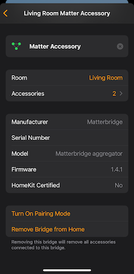
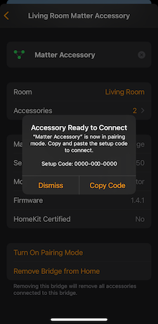
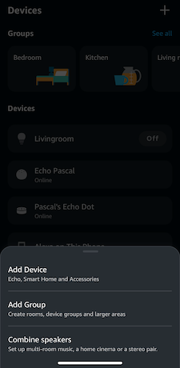
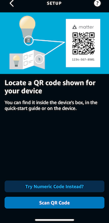
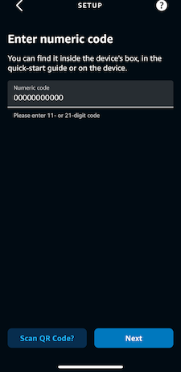

## How do I connect multiple fabrics / controllers like Google Home, Apple Home, or Alexa with a single bridge?

It is definitely possible to connect one bridge with multiple fabrics, but you cannot use the same QR code twice.
We need to commission the bridge with the first controller using the provisioned QR code. After that we need to use the
first controller to connect the bridge to all following controllers.

When you have successfully connected the first controller (e.g. Apple Home), open the app of that controller and find
the Hub device. In Alexa it is listed as an own device. In Apple Home you can find deep in the Home settings. Within the
device settings you can start pairing mode for the device. You will receive a manual pairing code which you can use to
connect it from the next controller.

### Example: Paired with Apple Home, then add it to Alexa

First hit the "more" button in the top right corner of your home:

Then select "Home Hubs & Bridges" to find all connected bridges.

From the list of Hubs & Bridges select your Matter hub.

At the bottom of the Hub details, select "Turn on Pairing Mode".

You will receive a manual pairing code, write it down, you will need it in a second.

Switch over to the Alexa app and add a new device.

Select "Matter" as kind of the device.

When asked for "Try Numeric code" or "Scan QR Code", select the numeric code.

Enter the numeric code you got from Apple Home previously.

Watch Alexa connecting to your bridge, too.

